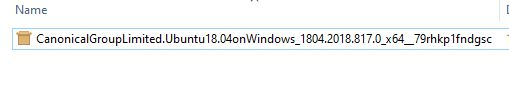
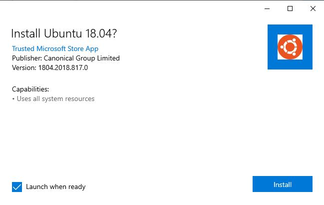
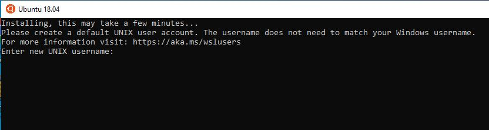
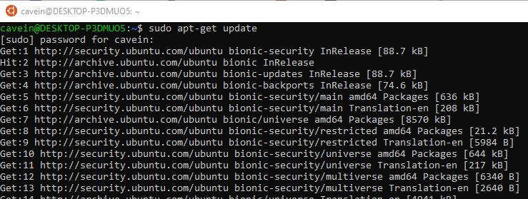

# Installing Ubuntu on Windows

I have no quarrels with Microsoft or any of it's windows variant but it has been a while since I last did anything related to development with it. The last time I developed in windows it was when WFT forms were at a hype and still then, I was just learning to use C\#. Back to the problem at hand, I needed a way to develop in Linux but the catch was the program am porting to is running on windows. There is a bunch of ways I would have solved this problem. One of the ways was just to swallow my pride and download development tools for windows. The second solution was to download a virtual machine and install a linux guest. The problem with this is that it would consume my rather limited computing resources. I finally come up with a third solution which was simply to use the Windows Subsystem for Linux  \(WSL\)

### Installing Windows Subsystem for Linux \(WSL\) in Windows 10

If you are a Linux fun as I am, windows has done a great job in ensuring installation of Linux on windows is as steamless as possible.

1. On the windows search bar, type `PowerShell`, right click and open as administrator.
2. Type the following command and press enter

```text
Enable-WindowsOptionalFeature -Online -FeatureName Microsoft-Windows-Subsystem-Linux
```

If successful `PowerShell` will prompt you to restart your system

After restart, got to store and type the name of the distribution you intend to use, in my case it was Ubuntu


### Installing Ubuntu without using Windows Store

There are a times things don't go exactly as planned and you may find yourself unable to access store. In that case, there is an option of downloading the distribution offline.

Choose the your distribution from the link below



A .appx file would be downloaded.



Double click the file 



Then you are to choose a username and a password.



Finally, you can now run your system as a normal Linux station



