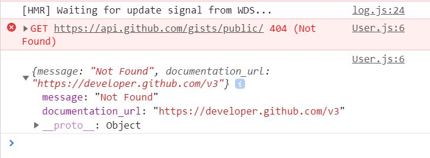

# Getting Data From the Internet

The next task is to fetch data from the GitHub API so that our application can consume the data. In JavaScript, there are various methods through which this can be accomplished. We are going to focus on the two commonly used methods.

#### 1. Using Fetch API

As the name implies, Fetch API is an in-build JavaScript module provide users with the ability to fetch resources from a website. The first thing we are going to do is to create a react class component called `Users.` We are then to fetch and display our data using the fetch API. 

`components/Users.js`

```jsx
import React, { Component } from "react";

class User extends Component {
  render() {
    const url = "https://api.github.com/gists/public";
    fetch(url)
      .then(res => res.json())
      .then(results => console.log(results)
      .catch(error => console.log(error));
    return (
      <div>
        <h2>User Data</h2>
      </div>
    );
  }
}

export default User;

```

From the developer tools console window, one should be able to view the data fetched from the API


Also notice that in case the `url` changes, the `catch` clause works.



#### **2. Using Axios**

Axios is much popular compared to Fetch in doing asynchronous API calls. There is a greater debate on the workings of each that we are not going to indulge into right now but for the moment let us see how to code in each

First, you need to install axios 

```jsx
$ yarn add axios
```

Then retype the code to reflect the one shown below:

`components/Users.js`

```jsx
import React, { Component } from "react";
import Axios from "axios";

class User extends Component {
  render() {
    const url = "https://api.github.com/gists/public";
    Axios.get(url)
    .then(response => console.log(response.data))
    .catch(error => console.log(error))
    return (
      <div>
        <h2>User Data</h2>
      </div>
    );
  }
}

export default User;

```

The response gotten is the same except that `axios` converts `JSON` data on the fly unlike the `Fetch API` that requires the `.json()` method to accomplish the same. 


Error messages are also more detailed in `axios` as shown below:


