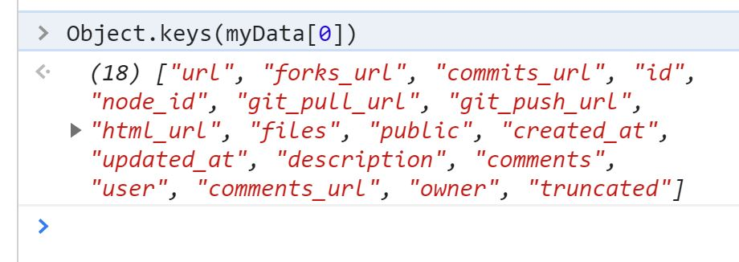

# Populating the State

Most react application deal with state. State refers to an object that stores information about any react application. As you will see later, as when the components of the State receive a change, the application will re-render to reflect the changes that have taken place.

Before we dive into the state, first lets chooses the values that we are going to need from the Github API. This requires us to pick the first element in the dictionary and choose our variables. This can be done using the browser developer tools. Open you browser in the console section of the developer tools type the following commands:

```javascript
let url = "https://api.github.com/gists/public"
fetch(url).then(res => res.json()).then(results => myData = results)
for (let property in myData[0]){console.log(property)}
```

You will realize that there are a `19 elements` inside our object. Alternatively, one can use the below code to list all objects ``

```javascript
let url = "https://api.github.com/gists/public"
fetch(url).then(res => res.json()).then(results => myData = results)
Object.keys(myData[0])
```

This displays a list as below



Since we are dealing with [gist](https://opentechschool.github.io/social-coding/extras/gists.html) we will limit ourselves to what we find relevant. 

```javascript
id
html_url
created_at
updated_at
description
comments
user
owner*
```

To populate the state, we are going to use the `ComponentDidMount()`  and  `setState . ComponentDidMount()` as the name suggest will only execute once the component has been rendered successfully by the browser.

```javascript
class User extends Component {
  state = {
    gist: []
  };

  componentDidMount() {
    const url = "https://api.github.com/gists/public";
    Axios.get(url)
      .then(response => response.data)
      .then(data => {
        this.setState({ gist: data });
        console.log(this.state.gist);
      })
      .catch(error => console.log(error));
  }
```

The code works as before, only this time we have stored our variable in state.

T

