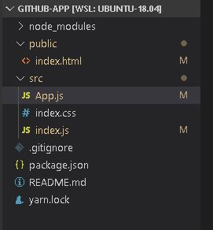

# React Front End

From the previous tutorial, we got our data from the GitHub API, in this tutorial, we are going to use `reactjs` to find a way to display this information using a custom UI. 

Make a new directory in your Linux installation. Make sure you have `git, yarn, node` and `nodejs` using the following commands.

```text
$ sudo apt update
$ sudo apt install git
$ sudo apt install node
$ sudo apt install nodejs
```

Note that `Ubuntu 18.04` installs `yarn 0.32` that does not accept create react-app command. To install the latest version, run the following commands on your terminal

```text
curl -sS https://dl.yarnpkg.com/debian/pubkey.gpg | sudo apt-key add -
echo "deb https://dl.yarnpkg.com/debian/ stable main" | sudo tee /etc/apt/sources.list.d/yarn.list
sudo apt update && sudo apt install yarn
```

Now install react. In this project we are going to use the `create-react-app cli`. Write the following commands:

```text
$ yarn create react-app github-app
```

After installation, run `yarn start` to check if everything is working fine. Your server should show you the react welcome page at [`http://localhost:3000/`](http://localhost:3000/)`.` We will be working with an empty template of our own therefore we perform the following clean up. We are going to remove files that we do not need so that our folder structure looks as the below image



We are also going to remove unnecessary code from so as the files looks like below

`src/index.js`

```javascript
import React from "react";
import ReactDOM from "react-dom";
import App from "./App";

ReactDOM.render(<App />, document.getElementById("root"));

```

`src/App.js`

```jsx
import React from "react";

const App = () => {
  return (
    <div>
      <h1>GitHub App</h1>
    </div>
  );
};

export default App;

```

`public/index.html`

```markup
<!DOCTYPE html>
<html lang="en">
  <head>
    <meta charset="utf-8" />
    <link rel="icon" href="%PUBLIC_URL%/favicon.ico" />
    <meta name="viewport" content="width=device-width, initial-scale=1" />
    <title>GitHub App</title>
  </head>
  <body>
    <noscript>You need to enable JavaScript to run this app.</noscript>
    <div id="root"></div>
  </body>
</html>
```

If you perform `npm start` you will be able to see the below display in [`http://localhost:3000/`](http://localhost:3000/) 


