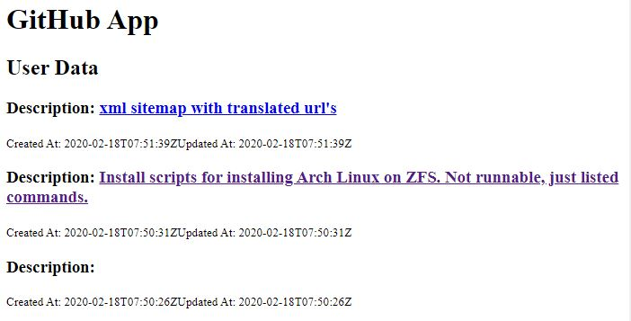

# Rendering the UI

As you may have noticed, we have been dealing with the console and displaying nothing in the browser apart from the static text we began with. React comes with the `map()` method that enables us loop through data and display it in the `UI`. You will find this method a common feature with you will use very often as you develop your react projects.

### The `map()` Function

The `map()` function is really handy when dealing with arrays. It enables one to quickly loop through a list displaying the needed data. Consider the following JSON file

```javascript
const todos = [
{
    "userId": 1,
    "id": 1,
    "title": "delectus aut autem",
    "completed": false
  },
  {
    "userId": 1,
    "id": 2,
    "title": "quis ut nam facilis et officia qui",
    "completed": false
  },
  {
    "userId": 1,
    "id": 3,
    "title": "fugiat veniam minus",
    "completed": false
  },
  {
    "userId": 1,
    "id": 4,
    "title": "et porro tempora",
    "completed": true
  }
]
```

If you wanted to find the list of tasks, one of the ways is to use a for loop

```javascript
let tasks = []

for(let i = 0; i < todos.length; i++) {
    let obj = todos[i];
		tasks.push(obj.title)
}
console.log(tasks) // ["delectus aut autem", "quis ut nam facilis et officia qui", "fugiat veniam minus", "et porro tempora"]
```

This can similarly be achieve using `map()` function

```javascript
let allTasks = []
const tasks = todos.map(task => {
 allTasks.push(task.title)
})
console.log(allTasks) // ["delectus aut autem", "quis ut nam facilis et officia qui", "fugiat veniam minus", "et porro tempora"]
```

To display our data to the UI, we write our JSX code directly on the map function as shown below:

```jsx
class User extends Component {
  state = {
    gist: []
  };

  componentDidMount() {
    const url = "https://api.github.com/gists/public";
    Axios.get(url)
      .then(response => response.data)
      .then(data => {
        this.setState({ gist: data });
      })
      .catch(error => console.log(error));
  }
  render() {
    const { gist } = this.state;
    const items = gist.map(item => {
      return (
        <div>
          <h3>
            Description: <a href={item.html_url}>{item.description}</a>
          </h3>
          <small>Created At: {item.created_at}</small>
          <small>Updated At: {item.updated_at}</small>
          <br />
        </div>
      );
    });
    return (
      <div>
        <h2>User Data</h2>
        <div>{items}</div>
      </div>
    );
  }
}

export default User;
```

This displays as follows:



As you may notice, sites with no URLs are also appearing which is not useful to us. Therefore will find a way of removing these sites so as to remain with only sites that have URL links

### The `filter()` Function

Just like the `map()` function is important in learning react, `filter()` function also plays an important role within the framework.

As we did with the map\(\) function, will first try the long method so as to show differences with each method

```jsx
const todos = [
{
    "userId": 1,
    "id": 1,
    "title": "delectus aut autem",
    "completed": true
  },
  {
    "userId": 1,
    "id": 2,
    "title": "quis ut nam facilis et officia qui",
    "completed": false
  },
  {
    "userId": 1,
    "id": 3,
    "title": "fugiat veniam minus",
    "completed": false
  },
  {
    "userId": 1,
    "id": 4,
    "title": "et porro tempora",
    "completed": true
  }
]

let completedTasks = [];
for (let i = 0; i < todos.length; i++) {
    if (todos[i].completed === true) {
        completedTasks.push(todos[i]);
    }
}
console.log(completedTasks.length); // shows 2 tasks completed
```

The above code can simply be replicated using `filter()` function

```jsx
var completedTasks = todos.filter((item)=>{
	if (item.completed === true) {
   return item.title
  }
});
console.log(completedTasks.length); // shows 2 tasks completed
```


