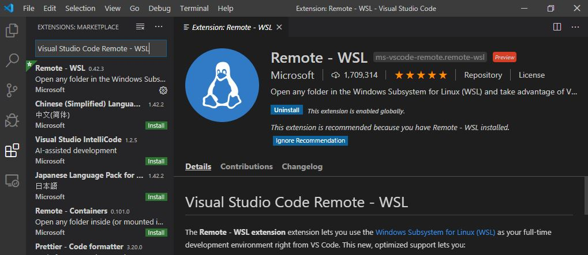
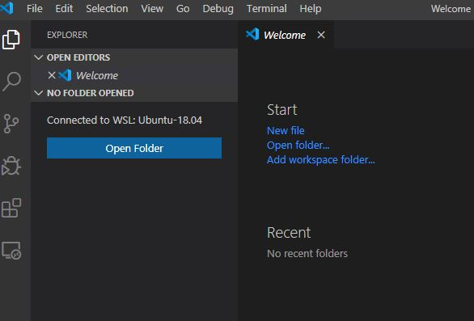
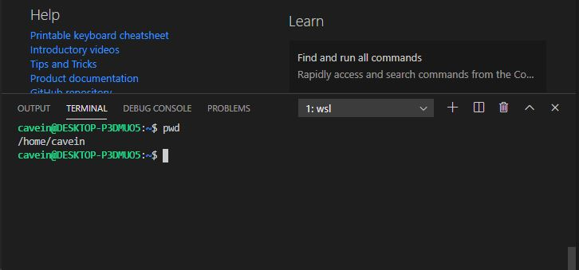

# Using VS Code in Windows Subsystem for Linux

In the previous article, we learnt how it was possible to install ubuntu in a WSL. In this section, we are going to learn how to use vs code with our installation.

The first process is to install  vs code from the site below



The install  `Visual Studio Code Remote - WSL` plugin for vs code

Next, you need to install `git` in your ubuntu installation using the following commands in terminal

`sudo apt update && sudo apt install git`

In vs code, go to `view -> command palette -> Remote -WSL: New Window Using disto`

A new vs code window will launch and show which disto you are running in my case, `ubuntu 18.04` as shown below

Using the blue Open Folder, open the folder of you liking or just use the `wsl terminal` from the vs code terminal drop down

